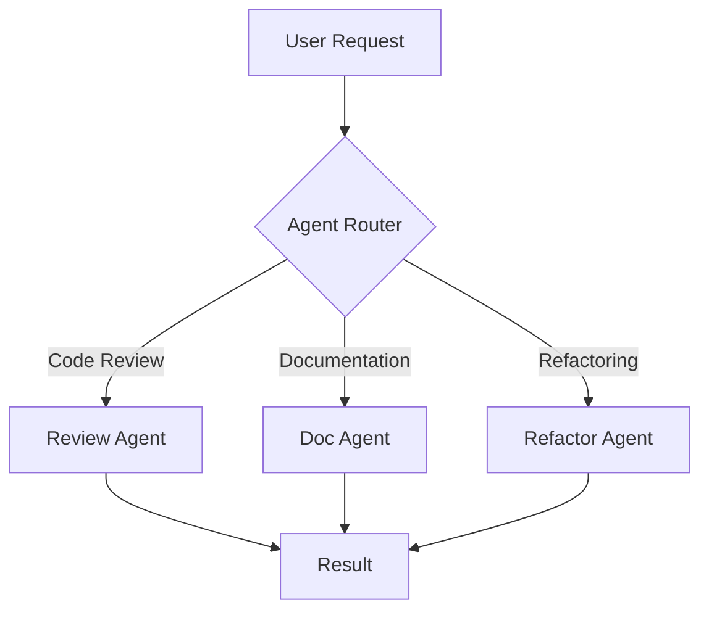

# GitHub Copilot Custom Instructions

This file configures GitHub Copilot behavior for this project.

## Project Context

This is an AI agent example project demonstrating modern agent patterns and integrations. When working in this codebase:

- Focus on agent architectures and patterns
- Emphasize clean separation of concerns
- Consider token efficiency and cost
- Implement robust error handling
- Follow the agent patterns defined in `agents.md`

## Code Generation Guidelines

### General Principles

1. **Type Safety**: Always use type hints in Python
2. **Documentation**: Include docstrings for all public functions
3. **Error Handling**: Implement try-except blocks for external API calls
4. **Logging**: Add appropriate logging statements
5. **Testing**: Generate tests alongside code

### Python Style

```python
# Preferred style
def review_code(
    code: str,
    context: dict[str, Any],
    severity_threshold: SeverityLevel = SeverityLevel.MEDIUM
) -> ReviewResult:
    """
    Review code for quality and security issues.
    
    Args:
        code: Source code to review
        context: Additional context (file path, project info)
        severity_threshold: Minimum severity level to report
    
    Returns:
        ReviewResult containing identified issues
    
    Raises:
        APIError: If the review service is unavailable
    """
    try:
        # Implementation
        pass
    except APIError as e:
        logger.error(f"Review failed: {e}")
        raise
```

### Agent-Specific Patterns

When generating agent code, follow these patterns:

#### 1. Agent Class Structure

```python
class AgentName:
    """Brief description of agent purpose."""
    
    def __init__(self, config: dict[str, Any]):
        self.config = config
        self.client = self._init_client()
        self.tools = self._init_tools()
        self.logger = logging.getLogger(__name__)
    
    def _init_client(self):
        """Initialize API client."""
        pass
    
    def _init_tools(self):
        """Initialize available tools."""
        pass
    
    def execute(self, task: Task) -> Result:
        """Main execution method."""
        pass
```

#### 2. Tool Definitions

```python
# Always use this structure for Claude tools
tools = [
    {
        "name": "tool_name",
        "description": "Clear description of what the tool does",
        "input_schema": {
            "type": "object",
            "properties": {
                "param_name": {
                    "type": "string",
                    "description": "Parameter description"
                }
            },
            "required": ["param_name"]
        }
    }
]
```

#### 3. Error Handling

```python
# Always implement retries and fallbacks for API calls
import backoff
from anthropic import RateLimitError

@backoff.on_exception(backoff.expo, RateLimitError, max_tries=3)
def call_api(self, prompt: str) -> str:
    try:
        response = self.client.messages.create(...)
        return response.content[0].text
    except APIError as e:
        self.logger.error(f"API call failed: {e}")
        raise
```

## Prompt Engineering

When generating prompts, follow these guidelines:

### System Prompts

- Be specific about the agent's role
- List clear responsibilities
- Define output format
- Include examples when helpful

```python
SYSTEM_PROMPT = """You are an expert {role}.

Your responsibilities:
1. {responsibility_1}
2. {responsibility_2}

Output format:
{format_description}

Examples:
{examples}
"""
```

### User Prompts

- Provide sufficient context
- Be explicit about requirements
- Include relevant code snippets
- Specify desired output format

## Testing

Generate tests for all agent code:

```python
import pytest
from unittest.mock import Mock, patch

class TestAgentName:
    @pytest.fixture
    def agent(self):
        config = {"model": "claude-sonnet-4.5"}
        return AgentName(config)
    
    def test_execute_success(self, agent):
        """Test successful execution."""
        result = agent.execute(Task("test task"))
        assert result.success
    
    def test_execute_handles_errors(self, agent):
        """Test error handling."""
        with patch.object(agent.client, 'messages') as mock:
            mock.create.side_effect = APIError("Error")
            with pytest.raises(APIError):
                agent.execute(Task("test task"))
```

## Configuration Files

When generating YAML configuration files:

```yaml
agent:
  name: "agent_name"
  type: "agent_type"
  model: "claude-sonnet-4.5"
  
  parameters:
    temperature: 0.7
    max_tokens: 4000
    
  capabilities:
    - capability_1
    - capability_2
  
  constraints:
    max_iterations: 5
    timeout_seconds: 30
  
  prompts:
    system: "path/to/system_prompt.md"
    templates:
      - "path/to/template.md"
```

## File Organization

When creating new files:

- Agent implementations go in `agents/`
- Configurations go in `agent_configs/`
- Prompts go in `prompts/system_prompts/` or `prompts/task_prompts/`
- Examples go in `examples/`
- Tests go in `tests/`

## Documentation

Generate markdown documentation with:

1. Clear title and description
2. Table of contents for long documents
3. Code examples with syntax highlighting
4. Mermaid diagrams for architecture
5. Links to related files

### Example Documentation Structure

```markdown
# Feature Name

Brief description.

## Overview

Detailed explanation.

## Usage

### Basic Example

\`\`\`python
# Code example
\`\`\`

### Advanced Example

\`\`\`python
# More complex example
\`\`\`

## Configuration

Explanation of configuration options.

## API Reference

### Class: ClassName

Methods and attributes.

## Best Practices

Recommendations.

## Troubleshooting

Common issues and solutions.
```

## Mermaid Diagrams

When creating diagrams, use Mermaid:



## Cost Optimization

Always consider cost in suggestions:

- Use Haiku for simple tasks
- Use Sonnet for general development
- Use Opus only for complex reasoning
- Implement caching for repeated requests
- Batch similar requests when possible

## Security

Never generate code that:

- Exposes API keys or secrets
- Executes arbitrary user input without validation
- Skips authentication/authorization
- Uses insecure cryptographic methods
- Logs sensitive information

Always:

- Use environment variables for secrets
- Validate and sanitize inputs
- Implement rate limiting
- Add security-focused comments

## Context-Aware Suggestions

When suggesting code completions:

1. **Check imports**: Suggest imports needed for the code
2. **Match style**: Follow existing code style in the file
3. **Consider context**: Use variables/functions already defined
4. **Type consistency**: Match existing type hint patterns
5. **Error handling**: Include appropriate error handling

## Multi-Agent Patterns

When working with multiple agents:

```python
# Supervisor pattern
class Supervisor:
    def __init__(self):
        self.agents = {
            'review': CodeReviewAgent(),
            'test': TestWriterAgent(),
            'doc': DocumentationAgent()
        }
    
    def delegate(self, task: Task) -> Result:
        agent = self._select_agent(task)
        return agent.execute(task)

# Chain pattern
class AgentChain:
    def __init__(self, agents: list[Agent]):
        self.agents = agents
    
    def process(self, input_data: Any) -> Any:
        result = input_data
        for agent in self.agents:
            result = agent.process(result)
        return result
```

## Async Patterns

Prefer async/await for I/O operations:

```python
import asyncio
from anthropic import AsyncAnthropic

class AsyncAgent:
    def __init__(self):
        self.client = AsyncAnthropic()
    
    async def process(self, task: Task) -> Result:
        response = await self.client.messages.create(
            model="claude-sonnet-4.5",
            max_tokens=4000,
            messages=[{"role": "user", "content": task.prompt}]
        )
        return Result(response.content[0].text)
    
    async def process_batch(self, tasks: list[Task]) -> list[Result]:
        results = await asyncio.gather(*[
            self.process(task) for task in tasks
        ])
        return results
```

## Logging

Use structured logging:

```python
import logging
import json

logger = logging.getLogger(__name__)

# Log with context
logger.info("Agent execution started", extra={
    "agent": "code_reviewer",
    "task_id": task.id,
    "model": "claude-sonnet-4.5"
})

# Log errors with details
try:
    result = agent.execute(task)
except Exception as e:
    logger.error("Agent execution failed", extra={
        "agent": "code_reviewer",
        "task_id": task.id,
        "error": str(e),
        "traceback": traceback.format_exc()
    })
    raise
```

## Performance Monitoring

Include performance tracking:

```python
from datetime import datetime
from functools import wraps

def monitor_performance(func):
    @wraps(func)
    def wrapper(*args, **kwargs):
        start = datetime.now()
        try:
            result = func(*args, **kwargs)
            duration = (datetime.now() - start).total_seconds()
            
            logger.info(f"{func.__name__} completed", extra={
                "duration": duration,
                "success": True
            })
            return result
        except Exception as e:
            duration = (datetime.now() - start).total_seconds()
            logger.error(f"{func.__name__} failed", extra={
                "duration": duration,
                "success": False,
                "error": str(e)
            })
            raise
    return wrapper
```

## References

- See [agents.md](../agents.md) for agent architecture patterns
- See [claude.md](../claude.md) for Claude-specific integration
- See [agent_configs/](../agent_configs/) for configuration examples

---

*These instructions help GitHub Copilot provide context-aware, high-quality suggestions aligned with this project's patterns and best practices.*
