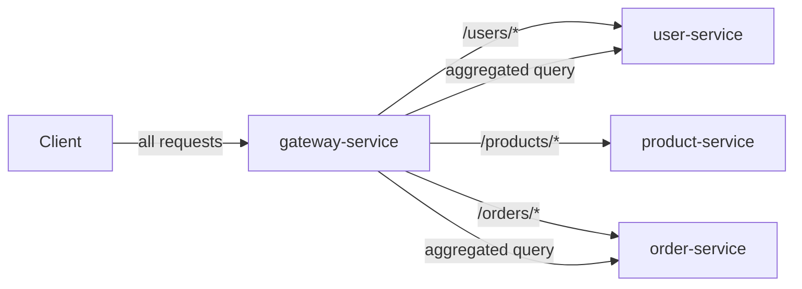
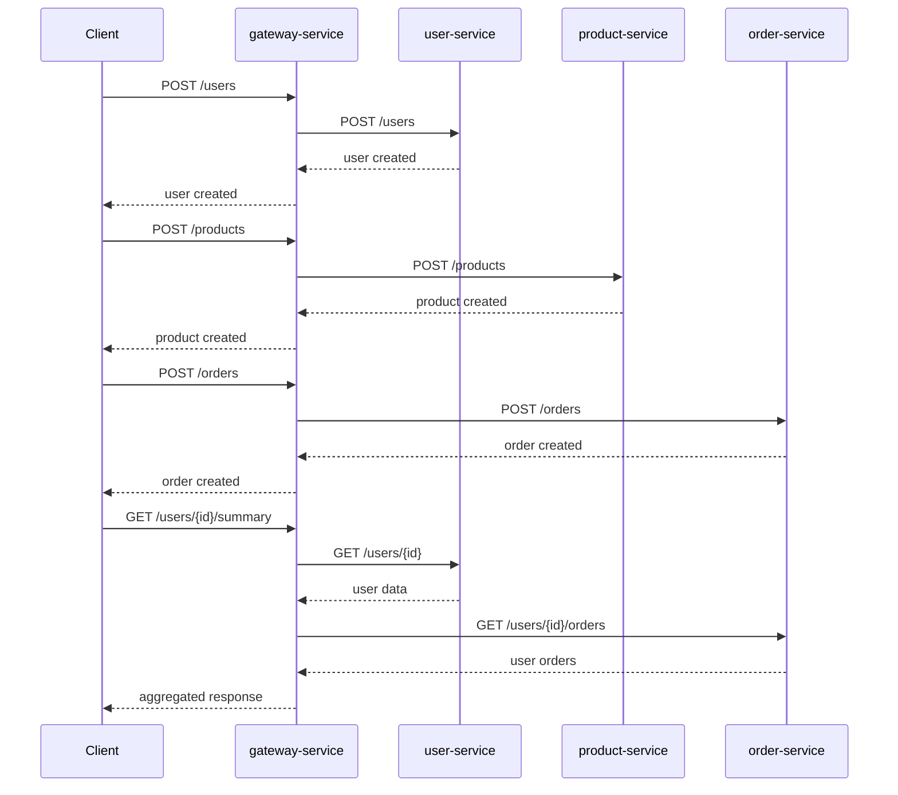

# API Gateway Pattern in Microservices (Docker Compose)

This folder contains an API Gateway example implemented with multiple backend services.

## Pattern Summary

API Gateway is a single entry point that routes client requests to appropriate backend services.

- **Single endpoint**: all clients connect to one gateway address instead of many individual services.
- **Routing**: gateway forwards requests to the correct backend based on path/method.
- **Aggregation**: gateway can combine responses from multiple services into one (e.g. user summary).
- **Cross-cutting concerns**: authentication, rate limiting, logging, and caching can live in the gateway.

## Why this pattern matters

In a microservice architecture, each service typically exposes its own set of endpoints. Clients would need to know the locations of all services and handle failures, authentication, and protocol details individually. This creates tight coupling between clients and the backend.

The API Gateway pattern solves this by:

- Hiding internal service boundaries from clients.
- Reducing the number of round-trips by aggregating responses.
- Providing a single place to enforce auth, rate limits, and other cross-cutting policies.
- Allowing backend services to evolve independently without breaking clients.

## Services in This Example

- `gateway-service` (FastAPI, port 8000)
- `user-service` (FastAPI, port 8001)
- `product-service` (FastAPI, port 8002)
- `order-service` (FastAPI, port 8003)

### Responsibilities

- `gateway-service` routes all client requests to the correct backend. It also aggregates user data with their orders in the `/users/{user_id}/summary` endpoint.
- `user-service` manages user profiles (CRUD).
- `product-service` manages product catalog (CRUD).
- `order-service` manages orders placed by users.

## Architecture Diagram



## Sequence Diagram



## API Gateway Principles Mapped to This Implementation

1. Single entry point
   - All requests go through `gateway-service` on port 8000.
   - Backend services are not directly exposed to clients.

2. Request routing
   - Path prefixes (`/users`, `/products`, `/orders`) are forwarded to the respective service.
   - Gateway is the only component that knows the internal service locations.

3. Response aggregation
   - `GET /users/{id}/summary` calls both `user-service` and `order-service` and merges their responses.
   - Clients get a complete view with a single request instead of multiple round-trips.

4. Client isolation
   - Backend services can be split, merged, or relocated without changing client code.
   - Only the gateway's routing configuration needs to change.

## Typical Use Cases

- Mobile and web applications that need a single backend endpoint.
- Microservice deployments where internal service topology changes frequently.
- Systems requiring centralized authentication, rate limiting, or logging.
- Scenarios where response aggregation reduces client-side complexity and latency.
- Migrating from monolith to microservices by placing a gateway in front.

## Trade-offs

### Pros

- Simplifies client code by hiding internal service topology.
- Enables centralized cross-cutting concerns (auth, logging, throttling).
- Supports response aggregation to reduce round-trips.
- Allows backend services to evolve independently.

### Cons

- Adds a single point of failure (mitigate with load balancing and redundancy).
- Can become a performance bottleneck under high load.
- Adds operational complexity (gateway must be deployed and maintained).
- Aggregation logic may bloat if too many service combinations are needed.

## Run with Docker Compose (WSL)

From repository root:

```bash
wsl
cd /mnt/c/Users/Admin/Documents/IT/Various-tools-and-notes/Architectural_patterns/API_Gateway
docker compose up --build
```

## Quick Demo Requests

In another terminal:

```bash
wsl
USER_ID=$(curl -s -X POST http://localhost:8000/users -H "Content-Type: application/json" -d '{"name":"Alice","email":"alice@example.com"}' | sed -E 's/.*"id":"([^"]+)".*/\1/')
PRODUCT_ID=$(curl -s -X POST http://localhost:8000/products -H "Content-Type: application/json" -d '{"name":"Widget","price":19.99}' | sed -E 's/.*"id":"([^"]+)".*/\1/')
curl -s -X POST http://localhost:8000/orders -H "Content-Type: application/json" -d "{\"user_id\":\"$USER_ID\",\"product_id\":\"$PRODUCT_ID\",\"quantity\":2}"
curl -s http://localhost:8000/users/$USER_ID/summary
```

## Optional Python Demo Client

```bash
wsl
cd /mnt/c/Users/Admin/Documents/IT/Various-tools-and-notes/Architectural_patterns/API_Gateway
python3 -m pip install -r requirements-demo.txt
python3 demo_client.py
```

## Files

- `docker-compose.yml`
- `services/Dockerfile`
- `services/requirements.txt`
- `services/gateway_service/app.py`
- `services/user_service/app.py`
- `services/product_service/app.py`
- `services/order_service/app.py`
- `demo_client.py`
- `requirements-demo.txt`
