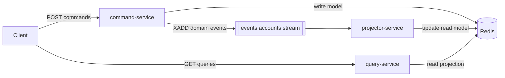
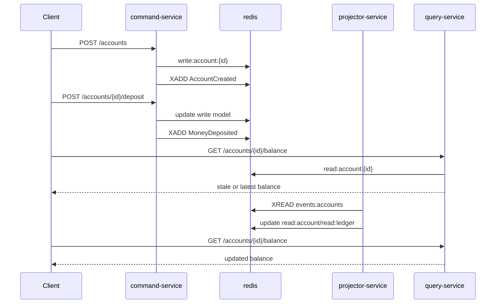

# CQRS Pattern in Microservices (Docker Compose)

This folder contains a CQRS example implemented in a microservices style.

## Pattern Summary

CQRS (Command Query Responsibility Segregation) splits write behavior from read behavior:

- Command side handles state changes and business rules.
- Query side handles reads and optimized data retrieval.
- The read model is updated asynchronously from events, so it can be eventually consistent.

## Services in This Example

- `command-service` (FastAPI, port 8001)
- `query-service` (FastAPI, port 8002)
- `projector-service` (background worker)
- `redis` (shared infrastructure for write state, event stream, and read projections)

### Commands (write side)

- `POST /accounts` creates an account.
- `POST /accounts/{account_id}/deposit` deposits money.

Command service stores write-model state and appends domain events into Redis stream `events:accounts`.

### Queries (read side)

- `GET /accounts/{account_id}/balance`
- `GET /accounts/{account_id}/ledger`

Query service reads only from read-model keys maintained by projector service.

### Projection (async read-model updater)

Projector consumes events from Redis stream and updates:

- `read:account:{id}` for balance/owner view
- `read:ledger:{id}` for timeline view

This demonstrates eventual consistency: immediate reads may be stale until projection catches up.

## Architecture Diagram



## Sequence Diagram



## CQRS Principles Mapped to This Implementation

1. Separate write/read responsibilities
- Write endpoints exist only in command service.
- Read endpoints exist only in query service.

2. Different models for different needs
- Write model: `write:account:{id}` keys for command-side validation and updates.
- Read model: `read:account:{id}` and `read:ledger:{id}` keys optimized for reads.

3. Event-driven propagation
- Commands emit events (`AccountCreated`, `MoneyDeposited`).
- Projector transforms events into queryable read projections.

4. Eventual consistency
- Query result may lag behind write events briefly.
- `PROJECTOR_DELAY_MS` is intentionally set to make lag visible in demo.

## Typical Use Cases

CQRS is useful when:

- write-side business logic is complex,
- read traffic is much higher than write traffic,
- read models must be denormalized and query-specific,
- read and write services need independent scaling/deployment,
- event-driven integrations are required.

## Trade-offs

- More infrastructure and operational complexity.
- Async consistency model requires explicit handling in clients/UI.
- Extra code for event contracts and projection logic.

For straightforward CRUD with low complexity, CQRS can be overkill.

## Run with Docker Compose (WSL)

From repository root:

```bash
wsl
cd /mnt/c/Users/Admin/Documents/IT/Various-tools-and-notes/Architectural_patterns/CQRS
docker compose up --build
```

## Quick Demo Requests

In another terminal:

```bash
wsl
ACCOUNT_ID=$(curl -s -X POST http://localhost:8001/accounts -H "Content-Type: application/json" -d '{"owner":"Alice"}' | sed -E 's/.*"account_id":"([^"]+)".*/\1/')
curl -s -X POST "http://localhost:8001/accounts/$ACCOUNT_ID/deposit" -H "Content-Type: application/json" -d '{"amount":150.0}'
curl -s "http://localhost:8002/accounts/$ACCOUNT_ID/balance"
sleep 1
curl -s "http://localhost:8002/accounts/$ACCOUNT_ID/balance"
curl -s "http://localhost:8002/accounts/$ACCOUNT_ID/ledger"
```

## Optional Python Demo Client

```bash
wsl
cd /mnt/c/Users/Admin/Documents/IT/Various-tools-and-notes/Architectural_patterns/CQRS
python3 -m pip install -r requirements-demo.txt
python3 demo_client.py
```

## Files

- `docker-compose.yml`
- `services/Dockerfile`
- `services/requirements.txt`
- `services/command_service/app.py`
- `services/query_service/app.py`
- `services/projector_service/app.py`
- `demo_client.py`
- `requirements-demo.txt`
