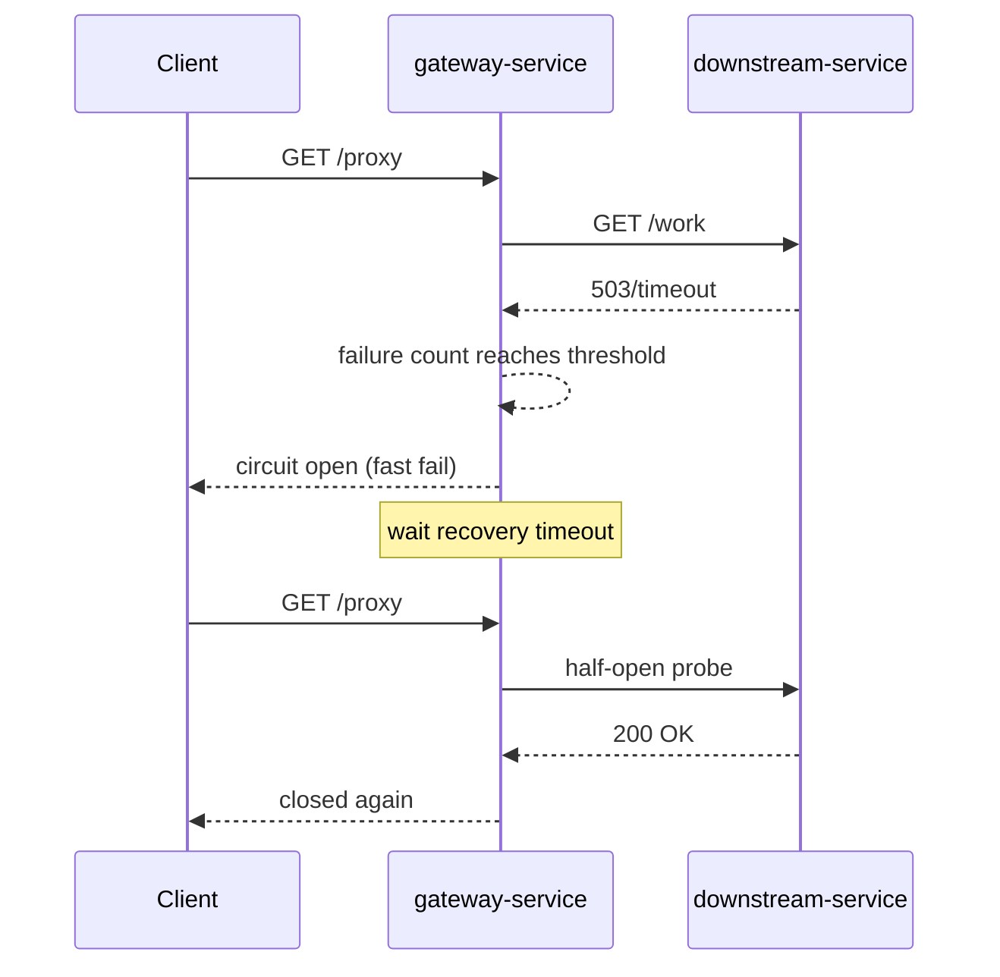

# Circuit Breaker Pattern in Microservices (Docker Compose)

This folder contains a minimal Circuit Breaker example implemented with two small services.

## Pattern Summary

Circuit Breaker protects a caller from repeatedly hitting an unhealthy dependency.

- **Closed**: calls flow normally.
- **Open**: calls fail fast without touching the dependency.
- **Half-open**: after cooldown, one trial call checks if dependency recovered.

This prevents thread/resource exhaustion and keeps failure localized.

### Why this pattern matters

In distributed systems, failures are often partial and temporary: one service is slow, one database shard is unavailable, or a third-party API has intermittent outages. Without a circuit breaker, callers keep sending requests and waiting for timeouts, which can saturate connection pools, worker threads, and CPU. This creates cascading failures where healthy services become unhealthy due to backpressure.

Circuit Breaker introduces controlled failure behavior:

- It converts repeated slow/failing calls into fast failures after a threshold.
- It gives dependencies time to recover by reducing traffic during incidents.
- It probes recovery safely through half-open trial calls before fully reopening traffic.

In practice, it is usually combined with timeouts, retries (with backoff), and fallback responses.

## Typical Use Cases

- Calling external APIs with variable latency and occasional outages (payments, maps, identity providers).
- Service-to-service calls in microservice architectures where one downstream can become a bottleneck.
- Accessing infrastructure dependencies such as databases, caches, or message brokers under degraded conditions.
- Protecting user-facing endpoints from long waits by failing fast and returning graceful fallback responses.
- Preventing retry storms when many clients would otherwise retry the same failing dependency.

## Pros and Cons

### Pros

- Improves resilience by containing failures and reducing cascading outages.
- Preserves resources (threads, sockets, connection pools) during dependency incidents.
- Reduces latency under failure by failing fast instead of waiting for repeated timeouts.
- Makes recovery smoother via half-open probing rather than immediate full traffic.
- Provides observability signals (open/close events, failure rates) useful for operations.

### Cons

- Adds operational complexity (threshold tuning, timeout choices, state management).
- Poor tuning can cause false positives (opening too early) or slow protection (opening too late).
- Half-open probes can still fail and may require careful concurrency control.
- In-memory breaker state is local per instance unless shared/distributed coordination is added.
- Does not fix root-cause dependency issues; it only limits blast radius.

## Design Considerations

- Set realistic request timeouts; breakers are ineffective if calls hang too long.
- Choose failure thresholds and recovery windows based on measured traffic/error patterns.
- Decide which errors should count as failures (timeouts, 5xx, connection errors) and which should not.
- Add metrics/logs for state transitions and failure counts to support alerting.
- Pair with fallback behavior where possible (cached data, default responses, queued work).

## Services in This Example

- `gateway-service` (FastAPI, port 8001)
- `downstream-service` (FastAPI, port 8002)

### Responsibilities

- `gateway-service` owns in-memory circuit breaker state and calls downstream via `GET /proxy`.
- `downstream-service` simulates behavior modes:
  - `healthy` (success),
  - `fail` (returns 503),
  - `slow` (sleeps; can trigger timeout in gateway).

## Architecture Diagram


## Sequence (Failure and Recovery)



## Circuit Breaker Settings

Configured in `docker-compose.yml` for `gateway-service`:

- `FAILURE_THRESHOLD=3`
- `RECOVERY_TIMEOUT_SECONDS=5`
- `REQUEST_TIMEOUT_SECONDS=1.5`

## Run with Docker Compose (WSL)

From repository root:

```bash
wsl
cd /mnt/c/Users/Admin/Documents/IT/Various-tools-and-notes/Architectural_patterns/Circut_breaker
docker compose up --build
```
