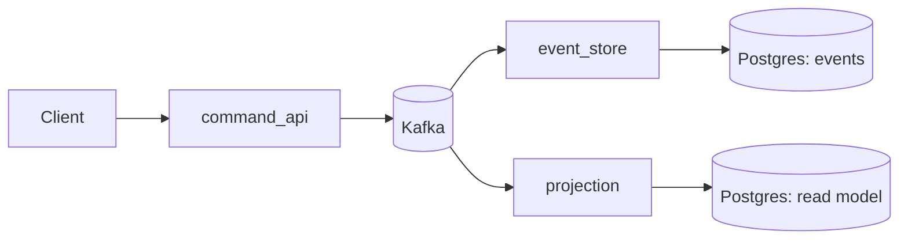

# Event Sourcing (Small Distributed Example)

Event sourcing records every state change as an immutable event, then derives current state by replaying those events into a read model. This keeps the write side append-only and auditable, while projections can be rebuilt or expanded without changing the event log.

## General Pattern Explanation

Event Sourcing stores **facts that happened** instead of storing only the latest row state.

- Traditional approach: update `balance=30` directly.
- Event-sourced approach: append events like `AccountCreated`, `MoneyDeposited(50)`, `MoneyWithdrawn(20)`.

Current state is reconstructed by replaying the ordered event stream for an aggregate (for example, an account).

In practice, Event Sourcing is commonly combined with CQRS:

- command side validates business rules and appends events,
- projection/read side builds query-optimized models from those events.

## Core Principles

1. **Events are immutable**
- Existing events are not edited or deleted; corrections are represented by new compensating events.

2. **Event log is the source of truth**
- Read models are disposable and can be rebuilt from the log.

3. **Ordered event streams per aggregate**
- Correct ordering is essential to preserve business invariants and deterministic replay.

4. **Versioned contracts**
- Event schemas evolve over time and require compatibility strategy.

5. **At-least-once processing awareness**
- Consumers/projections must be idempotent because duplicate delivery can happen.


**Services**
- `command_api`: accepts commands, publishes events to Kafka.
- `event_store`: consumes events, appends them to Postgres.
- `projection`: consumes events, maintains a read model in Postgres.

**Flow**
1. Command arrives in `command_api`.
2. Event is published to Kafka.
3. `event_store` saves the event log.
4. `projection` updates queryable state.

## Typical Use Cases

Event Sourcing is a strong fit when you need one or more of these:

- Full audit trail and historical reconstruction.
- Time-travel debugging (inspect state at time $t$).
- Complex business workflows where decisions depend on prior events.
- Multiple read models fed from the same domain event stream.
- Event-driven integrations with other systems.

Common domains: banking/fintech ledgers, order lifecycle management, inventory, workflow/process engines, compliance-heavy systems.

## Trade-offs

Benefits:

- Excellent auditability and traceability.
- Rebuildable projections and flexible reporting.
- Natural fit for event-driven architectures.

Costs:

- Higher design and operational complexity.
- Event schema evolution must be managed carefully.
- Replay/backfill operations can be expensive without snapshots.
- Eventual consistency on reads requires UX and API consideration.
- Debugging can span multiple services, topics, and projections.

For simple CRUD applications with low audit requirements, Event Sourcing is often unnecessary overhead.



Run:
```
docker compose up --build
```

Send commands:
```
curl -X POST localhost:8000/accounts -H "Content-Type: application/json" -d '{"account_id":"A-1","owner":"Ada"}'
curl -X POST localhost:8000/accounts/A-1/deposit -H "Content-Type: application/json" -d '{"amount":50}'
curl -X POST localhost:8000/accounts/A-1/withdraw -H "Content-Type: application/json" -d '{"amount":20}'
```
