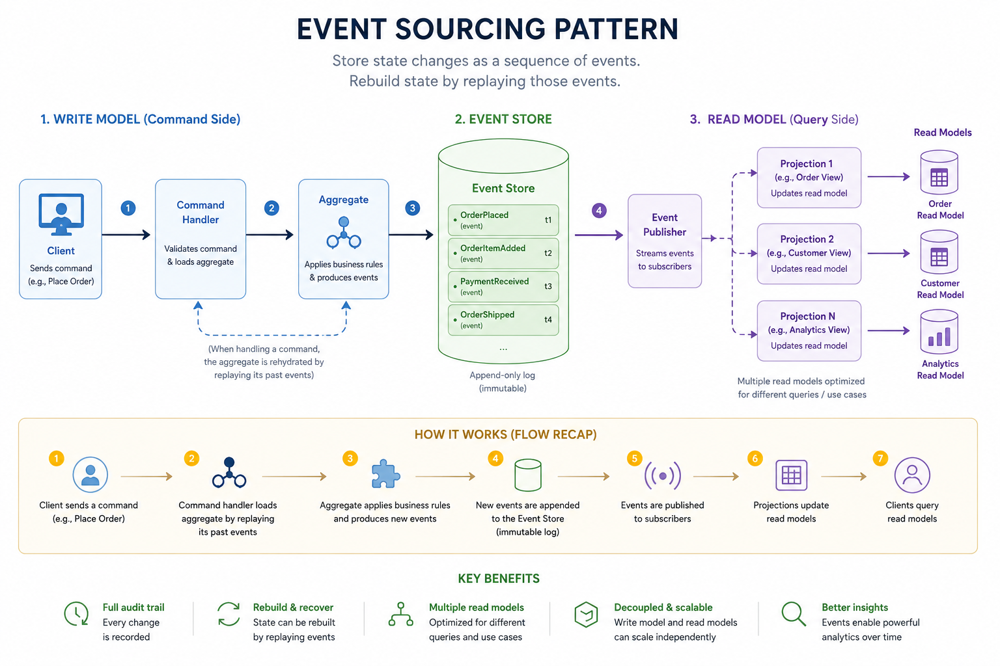
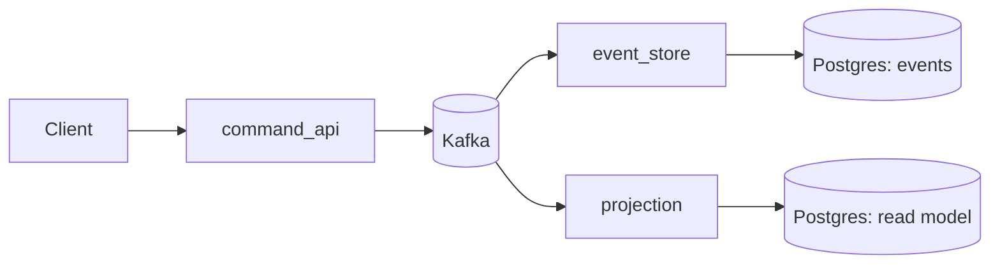

# Event Sourcing (Small Distributed Example)

Event sourcing records every state change as an immutable event, then derives current state by replaying those events into a read model. This keeps the write side append-only and auditable, while projections can be rebuilt or expanded without changing the event log.



**Services**
- `command_api`: accepts commands, publishes events to Kafka.
- `event_store`: consumes events, appends them to Postgres.
- `projection`: consumes events, maintains a read model in Postgres.

**Flow**
1. Command arrives in `command_api`.
2. Event is published to Kafka.
3. `event_store` saves the event log.
4. `projection` updates queryable state.



Run:
```
docker compose up --build
```

Send commands:
```
curl -X POST localhost:8000/accounts -H "Content-Type: application/json" -d '{"account_id":"A-1","owner":"Ada"}'
curl -X POST localhost:8000/accounts/A-1/deposit -H "Content-Type: application/json" -d '{"amount":50}'
curl -X POST localhost:8000/accounts/A-1/withdraw -H "Content-Type: application/json" -d '{"amount":20}'
```
