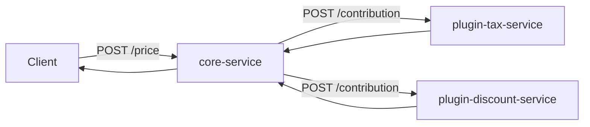
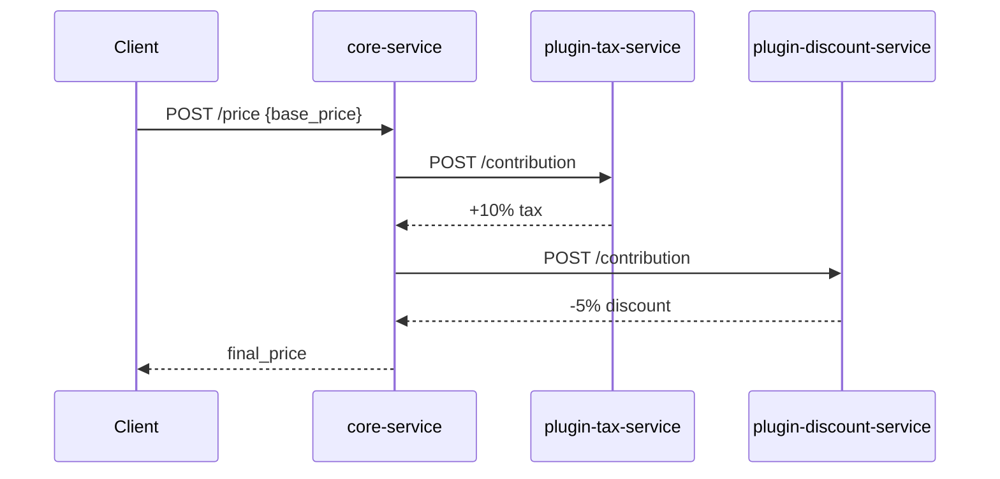

# Microkernel Pattern in Microservices (Docker Compose)

This folder contains a minimal Microkernel example implemented as tiny services.

## Pattern Summary

Microkernel splits a system into:

- Core system: stable workflow and extension points.
- Plugins: optional features that can be added, removed, or replaced without changing core logic.

In this demo:

- `core-service` is the microkernel.
- `plugin-tax-service` and `plugin-discount-service` are plugins.

Core receives a base price and asks each plugin for a contribution. Final price is:

- base price
- plus tax plugin amount
- plus discount plugin amount

## Services in This Example

- `core-service` (FastAPI, port 8001)
- `plugin-tax-service` (FastAPI, port 8002)
- `plugin-discount-service` (FastAPI, port 8003)

## Architecture Diagram



## Sequence Diagram



## Microkernel Principles Mapped to This Implementation

1. Stable core
- `core-service` owns API contract and orchestration order.

2. Pluggable extensions
- Plugins expose a shared contract: `POST /contribution`.

3. Isolation of optional behavior
- Tax and discount logic live outside the core.

4. Runtime composition
- Core discovers active plugins from `PLUGIN_URLS` environment variable.

## Trade-offs

Benefits:

- Easy to add new capabilities by adding plugin services.
- Core remains small and stable.
- Features can be enabled/disabled by configuration.

Costs:

- More network calls and service management overhead.
- Plugin contract/version compatibility must be managed.
- Partial plugin failures require fallback behavior.

## Run with Docker Compose (WSL)

From repository root:

```bash
wsl
cd /mnt/c/Users/Admin/Documents/IT/Various-tools-and-notes/Architectural_patterns/Microkernelr
docker compose up --build
```

## Quick Demo Requests

In another terminal:

```bash
wsl
curl -s -X POST http://localhost:8001/price -H "Content-Type: application/json" -d '{"base_price":100}'
curl -s -X POST http://localhost:8001/price -H "Content-Type: application/json" -d '{"base_price":250}'
```

Expected idea:

- for 100: tax +10, discount -5, final 105
- for 250: tax +25, discount -12.5, final 262.5

## Optional Python Demo Client

```bash
wsl
cd /mnt/c/Users/Admin/Documents/IT/Various-tools-and-notes/Architectural_patterns/Microkernelr
python3 -m pip install -r requirements-demo.txt
python3 demo_client.py
```

## Files

- `docker-compose.yml`
- `services/Dockerfile`
- `services/requirements.txt`
- `services/core_service/app.py`
- `services/plugin_tax_service/app.py`
- `services/plugin_discount_service/app.py`
- `demo_client.py`
- `requirements-demo.txt`
