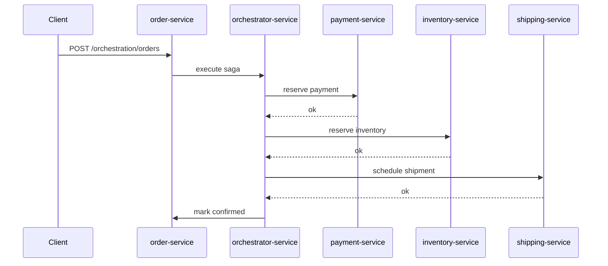
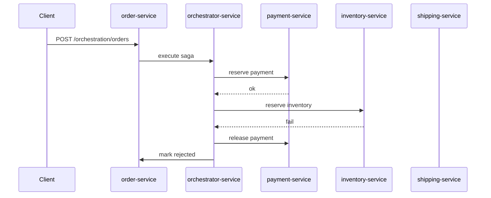
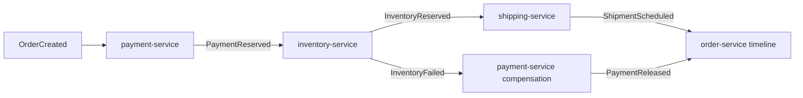

# SAGA Pattern in Microservices (Docker Compose)

This folder contains a distributed SAGA example with separate services and separate service databases. It demonstrates both common variations of the pattern:

- **Orchestration**: a dedicated orchestrator service drives the workflow.
- **Choreography**: services react to events on Redis without a central coordinator.

## Pattern Summary

Saga is a way to coordinate a business transaction that spans multiple services, each with its own database.

Instead of one global ACID transaction, each service performs a local transaction and publishes the result. If a later step fails, previously completed steps are undone through **compensating actions**.

In this example the business workflow is an order process:

- `payment-service` reserves money.
- `inventory-service` reserves stock.
- `shipping-service` schedules shipment.
- `order-service` stores order state and timeline.

If inventory fails after payment has already been reserved, the Saga compensates by releasing the payment reservation.

## Services in This Example

- `order-service` (FastAPI, port 8000)
- `orchestrator-service` (FastAPI, port 8001)
- `payment-service` (FastAPI, port 8002)
- `inventory-service` (FastAPI, port 8003)
- `shipping-service` (FastAPI, port 8004)
- `postgres` (one server with separate databases per service)
- `redis` (event bus for choreography)

### Databases

Each service owns its own logical database:

- `orders_db`
- `payments_db`
- `inventory_db`
- `shipping_db`

This mirrors a core microservice principle behind Saga: each service updates only its own persistent state.

## Variation 1: Orchestration

The client calls `POST /orchestration/orders` on `order-service`. That service stores the order and forwards execution to `orchestrator-service`.

The orchestrator then calls participant services in order:

1. reserve payment,
2. reserve inventory,
3. schedule shipment.

If a step fails, the orchestrator invokes compensations in reverse order.

The previous diagram only showed the failure branch. That made it look as if `shipping-service` was not part of orchestration, but in the actual implementation it is called after successful payment and inventory reservation.

Success path:



Failure path with compensation:



## Variation 2: Choreography

The client calls `POST /choreography/orders` on `order-service`. That service stores the order and publishes `OrderCreated` to Redis.

Each participant reacts to events:

- `payment-service` handles `OrderCreated` and publishes `PaymentReserved`.
- `inventory-service` handles `PaymentReserved` and publishes either `InventoryReserved` or `InventoryFailed`.
- `shipping-service` handles `InventoryReserved` and publishes `ShipmentScheduled`.
- `payment-service` handles `InventoryFailed` and publishes `PaymentReleased`.
- `order-service` listens to events and updates the order timeline/status.



## Saga Principles Mapped to This Implementation

1. Separate local transactions
- Each service writes only to its own database.

2. Compensation instead of distributed rollback
- `payment-service` exposes release behavior used after later failures.

3. Explicit failure handling
- Orchestration drives compensation centrally.
- Choreography encodes compensation through events.

4. Observable workflow history
- `order-service` stores an ordered timeline of saga events for inspection.

5. Eventual consistency
- In choreography, the order status moves through intermediate states before reaching `CONFIRMED` or `REJECTED`.

## Typical Use Cases

Saga is useful when:

- one business process spans multiple services and databases,
- two-phase commit is too heavy or unavailable,
- business rollback must be modeled explicitly,
- workflows like orders, bookings, reservations, or fulfillment are involved,
- the system can tolerate short-lived intermediate states.

## Trade-offs

Benefits:

- Fits microservices with database-per-service ownership.
- Makes cross-service failure handling explicit.
- Avoids global locks and distributed transaction managers.

Costs:

- Compensation logic increases complexity.
- Intermediate states are visible unless carefully hidden from clients.
- Choreography becomes harder to trace as the number of events grows.
- Orchestration can become a central bottleneck if it absorbs too much domain logic.

## Run with Docker Compose (WSL)

From repository root:

```bash
wsl
cd /mnt/c/Users/Admin/Documents/IT/Various-tools-and-notes/Architectural_patterns/SAGA
docker compose up --build
```

## Quick Demo Requests

In another terminal:

```bash
wsl
curl -s -X POST http://localhost:8000/orchestration/orders -H "Content-Type: application/json" -d '{"customer":"Ada","sku":"demo-item","amount":120}'
curl -s -X POST http://localhost:8000/orchestration/orders -H "Content-Type: application/json" -d '{"customer":"Ada","sku":"demo-item","amount":120,"force_inventory_failure":true}'
curl -s -X POST http://localhost:8000/choreography/orders -H "Content-Type: application/json" -d '{"customer":"Grace","sku":"demo-item","amount":75}'
curl -s -X POST http://localhost:8000/choreography/orders -H "Content-Type: application/json" -d '{"customer":"Grace","sku":"demo-item","amount":75,"force_inventory_failure":true}'
```

Then inspect a specific order:

```bash
curl -s http://localhost:8000/orders/<order_id>
```

## Optional Python Demo Client

```bash
wsl
cd /mnt/c/Users/Admin/Documents/IT/Various-tools-and-notes/Architectural_patterns/SAGA
python3 -m pip install -r requirements-demo.txt
python3 demo_client.py
```

## Files

- `docker-compose.yml`
- `services/Dockerfile`
- `services/requirements.txt`
- `services/order_service/app.py`
- `services/orchestrator_service/app.py`
- `services/payment_service/app.py`
- `services/inventory_service/app.py`
- `services/shipping_service/app.py`
- `services/common/runtime.py`
- `services/postgres/init-multiple-dbs.sh`
- `demo_client.py`
- `requirements-demo.txt`